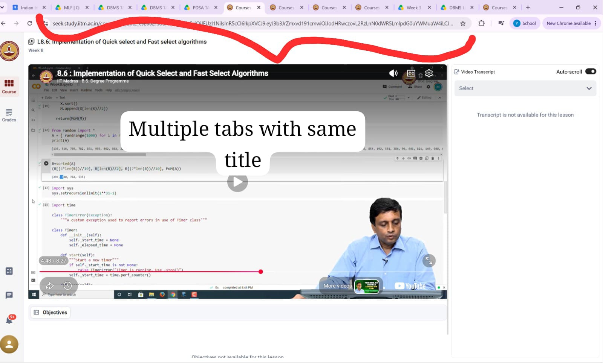
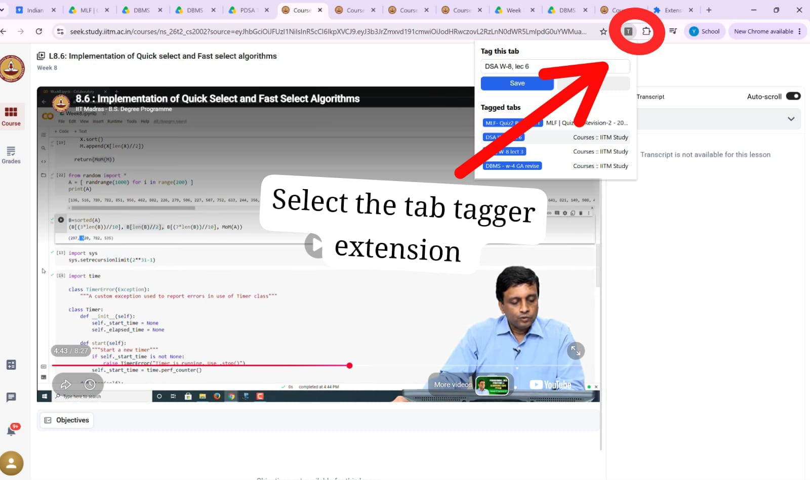
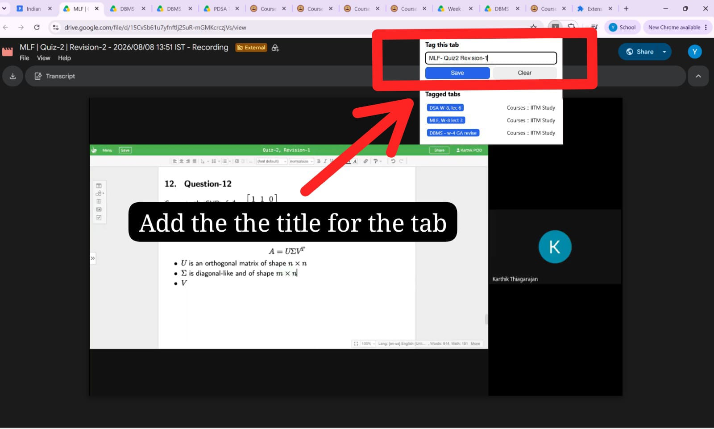
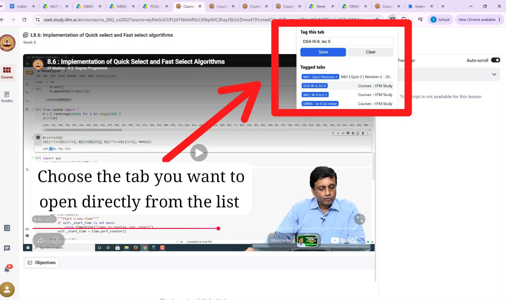
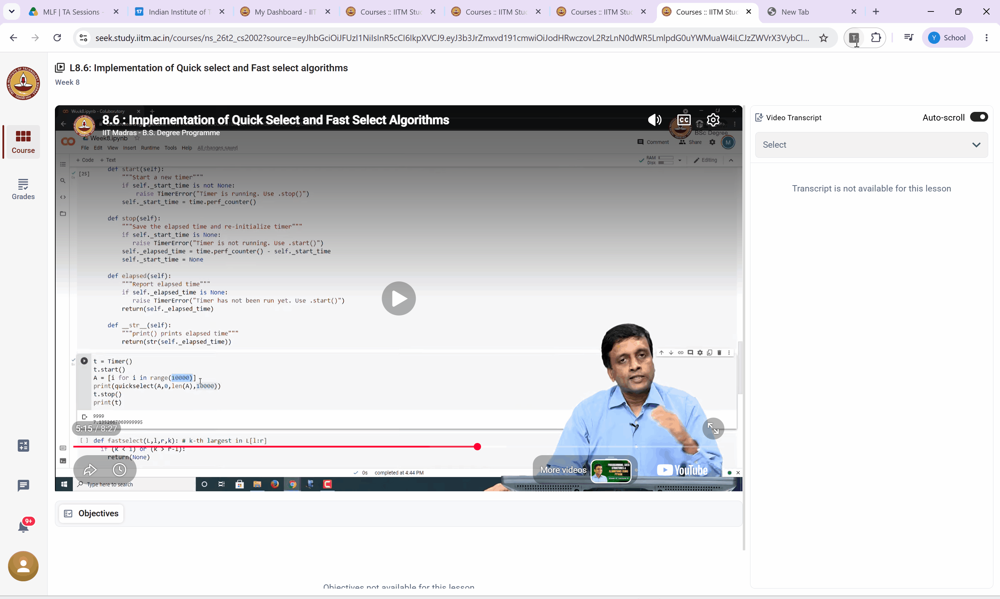

# Tab Tagger

A tiny Chrome extension that lets you tag or label your browser tabs - so you never lose track of which tab is which when several of them look identical.

## The problem

I built this while studying for my IITM BS Data Science program. On the course portal, I'd often have several video tabs open at once - a revision session, a PYQ (previous year questions) walkthrough, a regular course lecture - and they'd all show the exact same subject name in the tab title. Every time I switched tabs, I had to click into each one just to figure out which video was which. It was a small but constant annoyance, so I decided to fix it myself instead of living with it.

## The solution

Tab Tagger adds a custom label to any tab, right from a simple popup. Tag a tab "PYQ," "Revision," or "Course," and it shows up in a quick list of all your tagged tabs - click any one to jump straight to it.

## Features

- Add a custom tag to any open tab in one click
- Tag persists even after the page reloads or navigates
- A quick-access list in the popup shows all your tagged tabs - click one to jump straight to it
- Clear a tag anytime to restore the original title
- Lightweight: no tracking, no external servers, everything stays in your browser

## Installation (from source)

1. Download or clone this repository
2. Open Chrome and go to `chrome://extensions`
3. Turn on **Developer mode** (top-right toggle)
4. Click **Load unpacked** and select the `tab-tagger` folder
5. Pin the extension icon to your toolbar for quick access

## Usage

1. Open the tab you want to label
2. Click the Tab Tagger icon in your toolbar
3. Type a tag (e.g. "PYQ", "Revision", "Course") and click **Save**
4. The tab title updates immediately, and stays tagged even if the page reloads
5. Use the "Tagged tabs" list in the popup to jump between all your labeled tabs

## Screenshots

**The problem — many tabs, identical titles, no way to tell them apart:**

**Opening the Tab Tagger extension:**

**Tagging a tab with a custom label:**

**The tagged tabs list — click any entry to jump straight to that tab:**

## Demo

## Tech stack

- Chrome Extension Manifest V3
- Vanilla JavaScript
- `chrome.storage`, `chrome.tabs`, and `chrome.scripting` APIs

## Why I built this

This started as a personal fix for a problem I ran into constantly while studying - not a tutorial project. It's small, but it solves a real, everyday annoyance, and that felt worth sharing.

## Author

Built by Yashi Saxena - https://www.linkedin.com/in/nitresilient

## License

MIT — free to use, modify, and share.
